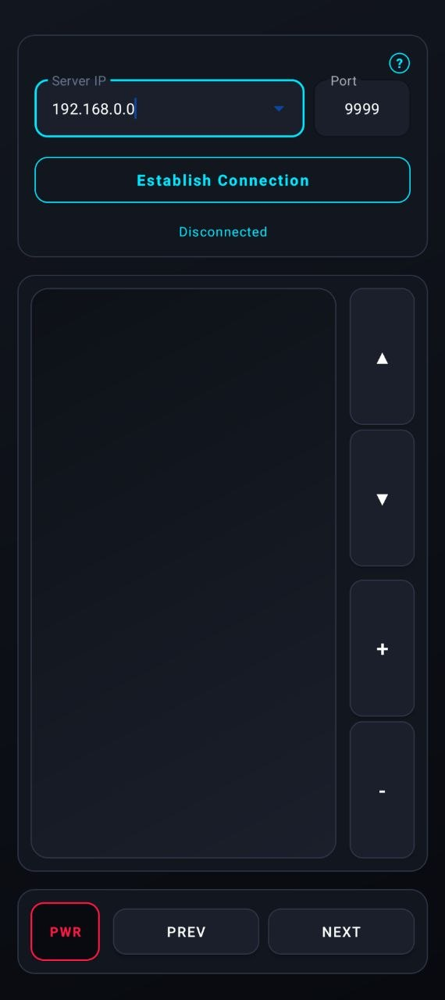
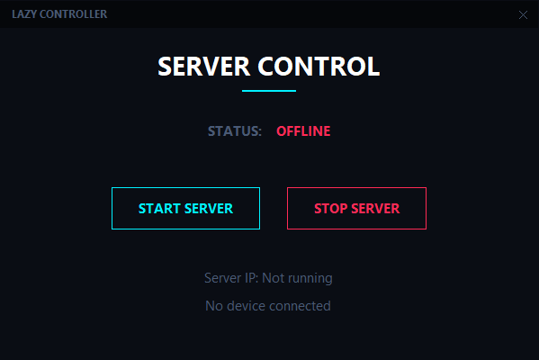

  <h1>Lazy Controller 🎮</h1>
  
A futuristic, seamless way to control your PC directly from your Android phone.

## 📋 What is this app?

[cite_start]**Lazy Controller** is a remote control application that transforms your Android smartphone into a wireless mouse, keyboard, and media controller for your Windows PC[cite: 2].

[cite_start]Whether you are watching a movie from bed, giving a presentation, or just want to navigate your computer without sitting at the desk, you can easily control your PC over your local Wi-Fi network[cite: 4].

### ✨ Features

- [cite_start]**Mouse Control:** Move the cursor, scroll, and click with a highly responsive trackpad[cite: 5, 20].
- **Keyboard Navigation:** Arrow keys for quick media or presentation control.
- [cite_start]**Media & System:** Adjust your PC's volume or even shut down your computer remotely[cite: 12].
- [cite_start]**Modern UI:** A clean, futuristic dark/neon cyber-design for both mobile and desktop[cite: 7].

---

## 📸 Screenshots

  
  &nbsp;&nbsp;&nbsp;&nbsp;&nbsp;&nbsp;
  

---

## 🚀 Download & Install

We have created a simple, dedicated webpage where you can download the latest versions of both the Android App and the Windows Server.

**📥 [CLICK HERE TO VISIT THE DOWNLOAD PAGE](https://majdAlmotaem.github.io/mouseApp/)**

### How to use:

1. **Download the Windows Server (`.exe`)** from the website and run it on your PC.
2. Click **"Start Server"** on the PC app. It will display your local IP address.
3. **Download and install the Android App (`.apk`)** on your phone.
4. [cite_start]Open the mobile app, enter the IP address shown on your PC, and tap Connect[cite: 4]!

[cite_start]_(Note: Both your phone and PC must be connected to the same Wi-Fi network. Ensure your Windows Firewall allows the application to communicate over the network on port 9999 [cite: 19])._

---

## 📄 License

This project is open-source and available under the **MIT License**. See the [LICENSE](LICENSE) file for more details.
